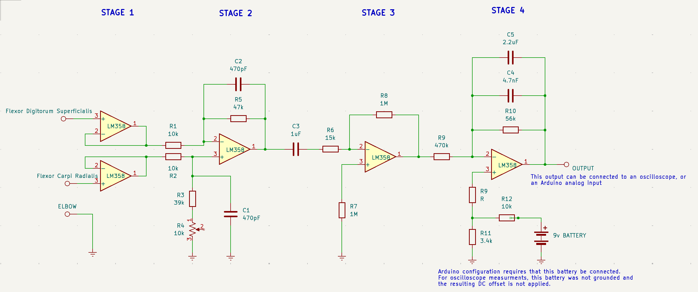

# EMG-Bridge Phase 1 / The Arduino Shield

The intent behind this phase is to develop an Arduino Uno R3 shield capable of attatching on to the the Uno and showing EMG data on the arduino IDE given the program code.
Power for the whole device would still be supplied by two 9v batteries and the user's computer. Serial communication through USB would still be necessary for transmitting data.
Data would still only be displayed on the computer. The design for the ECG circuit would still be taken directly from Group 15's (my group) UVA's IDEAS Lab II Module 10 expiriment.

## Schematic

## Next Phase
The next phase will focus on moving away from the arduino environment to use stm32 or esp32 microcontrollers. The idea being that following this step, a more compact design could be acomplished.
A PCB could be manufactured that houses both the microcontroller of this device and the EMG circuit. 
